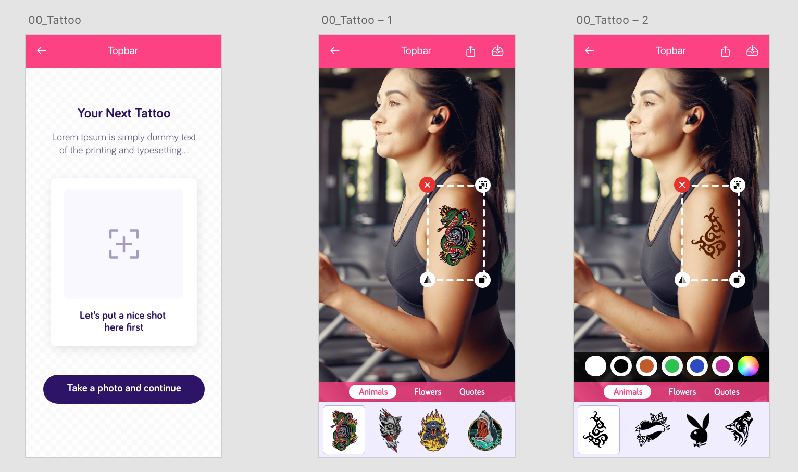

# Sticker Module
 Sticker Module lets you overlap images with sticker images which can be transformed, rotated and their colors, sizes can be changed.

Sticker Module get sticker images data from API. Lists and overlap the images for you.

Can be customizable (titles & action texts & alert texts & colors & fonts) and show however you like.

>**Minimum iOS version: 12**

# Import Sticker
```swift
    import Sticker
```

# Start Sticker
It is better to start it before showing it. **Concerns for API performance**  -- This means when you start it, Sticker Module makes an API call. This request is async but somehow if you have performance concerns about app start timing it is better to make it in somewhere else than the application didFinishLaunchingWithOptions it is totally up to you and depends on the project.
```swift
    ImageTransform.start(
      with:  <#URL#>, // Required - the api url needed for sticker thumbnails and sticker images
      projectID: <#String#>) // Required - Where to get? From Kerim or Gust
     .addColorOptions(stickerColors: [<#String#>])  // Optional - An array of color options to be used to color sticker images - default value is ["#FFFFFF", "#000000", "#C15B2E", "#2EC150", "#2E4AC1", "#C12E99"]
```

# Usage
>** There are two screens in the module. The first one, ImagePickerViewController, lets you handle the image source selection from camera or photo library. But that one is optional, if you do not need that, just made "withImagePicker" parameter false. The second one which handles all operations about Sticker is ImageTransformViewController which is required. If you will not need ImagePickerViewController, then you must send an image to that with "inputImage" parameter.

## Push & Present
If you already covered your way to use Sticker this suits for you

### Present
You can present it modally or let the module use its own navigation controller
>** "isModallyPresented" parameter lets you to present  it modally or with Sticker's Navigation Controller**
```swift
	ImageTransform.shared.ondidViewOpened {
		print("ondidViewOpened")
	}.onLoadFailed {
		print("onLoadFailed")
	}.ondidTapCloseButton {
		print("ondidTapCloseButton")
	}.onEditFinishBlock(editFinished: { (editedImage, stickerEditModel) in
		print("onEditFinishBlock")
	}).present(
	  	fromRootViewController: <#T##UIViewController#>, // Your root View Controller
      	isModallyPresented: <#Bool#>, // Optional - Default value is false - Lets you to present modally or from Sticker's Navigation Controller
	  	animated: <#Bool#>, // Optional - Default value is true
      	isFullScreen: <#Bool#>, // Optional - ModalPresentationStyle default is .formSheet if set true it will change to .fullScreen
      	withImagePicker: <#Bool#>, // Optional - Default value is false - if it is false then it will not present the first screen, it will directly go to sticker editor. But in this case you have to pass inputImage parameter. 
      	inputImage: <#UIImage#>, // Optional - Default value is nil - The image the stickers will overlap on it.
	  	editModel: <#StickerEditImageModel#> // Optional - Default value is nil -The module will store all the stickers and their properties on this object so that you can control and edit the designed stickered image later.
    )
```

### Push
You can push from your Navigation Controller
```swift
    ImageTransform.shared.ondidViewOpened {
		print("ondidViewOpened")
	}.onLoadFailed {
		print("onLoadFailed")
	}.onEditFinishBlock(editFinished: { (editedImage, stickerEditModel) in
		print("onEditFinishBlock")
	}).push(
	   fromNavigationController: <#T##UINavigationController#>, // Required - You navigation controller
	   animated: <#T##Bool#>, // Optional - Default value is true
	   withImagePicker: <#T##Bool#>, // Optional - Default value is false - if it is false then it will not present the first screen, it will directly go to sticker editor. But in this case you have to pass inputImage parameter. 
	   inputImage: <#T##UIImage?#>, // Optional - Default value is nil - The image the stickers will overlap on it.
	   editModel: <#T##StickerEditImageModel?#> // Optional - Default value is nil -The module will store all the stickers and their properties on this object so that you can control and edit the designed stickered image later.
	   )
```
>  Important! - If your Navigation Bar is hidden, remember to display before open Sticker it in order to get back
```swift
    override func viewWillDisappear(_ animated: Bool) {
        super.viewWillDisappear(animated)
        
        // Unhide NavigationBar
        // ============================================================
        self.navigationController?.setNavigationBarHidden(false, animated: true)
    }
```

## Add as a child | Add as a child in view
In your view controller you can add Sticker Module as add as child 

```swift
    ImageTransform.shared.ondidViewOpened {
		print("ondidViewOpened")
	}.onLoadFailed {
		print("onLoadFailed")
	}.onEditFinishBlock(editFinished: { (editedImage, stickerEditModel) in
		print("onEditFinishBlock")
	}).addChild(
	  parent: <#T##UIViewController#>, // Required - The ViewController the module will be added
	  withCloseShareButtons: <#T##Bool#>, // Optional - Default value is true - Close, share and download button shown or not
	  withImagePicker: <#T##Bool#>, // Optional - Default value is false - if it is false then it will not present the first screen, it will directly go to sticker editor. But in this case you have to pass inputImage parameter. 
	  inputImage: <#T##UIImage?#>, // Optional - Default value is nil - The image the stickers will overlap on it.
	  editModel: <#T##StickerEditImageModel?#> // Optional - Default value is nil -The module will store all the stickers and their properties on this object so that you can control and edit the designed stickered image later.
	)
```

> Optinally if you want to add child view controller in a container UIView than use this method:

```swift
    ImageTransform.shared.ondidViewOpened {
		print("ondidViewOpened")
	}.onLoadFailed {
		print("onLoadFailed")
	}.onEditFinishBlock(editFinished: { (editedImage, stickerEditModel) **in**
		print("onEditFinishBlock")
	}).addChildInView(
	  parent: <#T##UIViewController#>, // Required - The ViewController the module will be added
	  view: <#T##UIView#>, // Required - The Container view
	  withCloseShareButtons: <#T##Bool#>, // Optional - Default value is true - Close, share and download button shown or not
	  withImagePicker: <#T##Bool#>, // Optional - Default value is false - if it is false then it will not present the first screen, it will directly go to sticker editor. But in this case you have to pass inputImage parameter. 
	  inputImage: <#T##UIImage?#>, // Optional - Default value is nil - The image the stickers will overlap on it.
	  editModel: <#T##StickerEditImageModel?#> // Optional - Default value is nil -The module will store all the stickers and their properties on this object so that you can control and edit the designed stickered image later.
	)
```

# Configure Colors
Sticker module has 2 main + 2 text + 1 TakePhotoButtonTextColor +  1 SelectorsBackColor + 1 NavigationTitleColor= 7 colors which can be configurable default values of the color 
```swift
    ImageTransform.configure.configureColors(
	  bgColor: <#T##UIColor?#>, // Optional - Default value is UIColor(red: 0.99, green: 0.26, blue: 0.51, alpha: 1.00)
      secondaryColor: <#T##UIColor?#>, // Optional - Default value is UIColor(red: 0.94, green: 0.93, blue: 1.00, alpha: 1.00)
      textColor: <#T##UIColor?#>, // Optional - Default value is UIColor(red: 0.18, green: 0.08, blue: 0.40, alpha: 1.00)
      secondaryTextColor: <#T##UIColor?#>, // Optional - Default value is UIColor(red: 0.45, green: 0.41, blue: 0.53, alpha: 1.00)
      takePhotoButtonTextColor: <#T##UIColor?#>, // Optional - Default value is .white
      selectorsBackColor: <#T##UIColor?#>, // Optional - Default value is .white
      navigationTitleColor: <#T##UIColor?#> // Optional - Default value is .white
)
```



# Configure Fonts
Sticker module has 3 fonts as follows
```swift
    ImageTransform.configure.configureFonts(
	  primaryFont: <#T##UIFont?#>,
      secondaryFont: <#T##UIFont?#>,
	  titleFont: <#T##UIFont?#>
	)
```

# Configure Title Texts
Sticker module has 3 title texts can be costumized
```swift
      ImageTransform.configure.configureTitleTexts(
		withTitle: <#T##String?#>,
		withDescriptionText: <#T##String?#>,
		withNavBarTitle: <#T##String?#>
	  )
```

# Configure Action Texts
Sticker module has 2 action texts can be costumized
```swift
      ImageTransform.configure.configureActionTexts(
		withPhotoActionText: <#T##String?#>, // Optional - Defaut value is "Let's put a nice shot here first"
		withTakePhotoButtonText: <#T##String?#> // Optional - Defaut value is "Take a photo and continue"
	  )
```

# Configure Photo Saved Alert Texts
Sticker module has 4 alert texts for the alert to be displayed when photo saved successfully
```swift
      ImageTransform.configure.configurePhotoSavedAlertTexts(
		withAlertTitle: <#T##String?#>, // Optional - Defaut value is "Saved!"
		withAlertMessageText: <#T##String?#>, // Optional - Defaut value is "Your altered image has been saved to your photos."
		withAlertButtonTitle: <#T##String?#>, // Optional - Defaut value is "OK"
		withAlertSavingErrorText: <#T##String?#> // Optional - Defaut value is ""Save error""
	  )
```

# Configure Selection Of Image Source Texts
Sticker module has 5 texts for the alert to be displayed for user to choose the image source.
```swift
      ImageTransform.configure.configureSelectionOfImageSourceText(
		withSourceSelectionTitle: <#T##String?#>, // Optional - Defaut value is "Image Selection"
		withSourceSelectionMessage: <#T##String?#>, // Optional - Defaut value is "From where you want to pick this image?"
		withCameraSourceText: <#T##String?#>, // Optional - Defaut value is "Camera"
		withPhotoGallerySourceText: <#T##String?#>, // Optional - Defaut value is "Photo Album"
		withCancelText: <#T##String?#> // Optional - Defaut value is "Cancel"
	  )
```

# Configure Close Alert Texts
Sticker module has 4 alert texts for alert be displayed when the user is trying to leave the module.
```swift
    ImageTransform.configure.configureCloseAlertTexts(
      withAlertTitle: <#T##String?#>, // Optional - Defaut value is "Changes will not be saved. Are you sure you want to exit?"
      withAlertMessageText: <#T##String?#>, // Optional - Defaut value is ""
      withAlertOkButtonText: <#T##String?#>, // Optional - Defaut value is "OK"
      withAlertCancelButtonText: <#T##String?#> // Optional - Defaut value is "Cancel"
    )
```

# Example Usages
## Basic load & show
Data may be late with network
```swift
import UIKit
import Sticker

class ViewController: UIViewController {

    override func viewDidLoad() {
        super.viewDidLoad()
        
        let url = URL(string: "https://www.50dirham.com/v1/tattoo_module?asd2=*")! // the api url needed for sticker thumbnails and sticker images
		ImageTransform.start(with: url, projectID: "5ff4ab033831fb0001a0dee6").addColorOptions(stickerColors: ["#FFFFFF", "#000000", "#C15B2E", "#2EC150", "#2E4AC1", "#C12E99"])
		
		// Configure Stickers' All Texts & Fonts & Colors
		// ============================================================

		ImageTransform.configure.configureColors(bgColor: UIColor.blue, 			secondaryColor: UIColor.red, textColor: UIColor.yellow, secondaryTextColor: UIColor.green, takePhotoButtonTextColor: UIColor.gray, selectorsBackColor: UIColor.purple, navigationTitleColor: UIColor.orange)
		ImageTransform.configure.configureFonts(primaryFont: .boldSystemFont(ofSize: 21), secondaryFont: .systemFont(ofSize: 20), titleFont: .boldSystemFont(ofSize: 27))
		ImageTransform.configure.configureTitleTexts(withTitle: "Your Next Tattoo", withDescriptionText: "Lorem Ipsum is simply dummy text of the printing and typesetting...", withNavBarTitle: "TopBar")
		ImageTransform.configure.configureActionTexts(withPhotoActionText: "Let’s put a nice shot here first", withTakePhotoButtonText: "Take a photo and continue")
		ImageTransform.configure.configurePhotoSavedAlertTexts(withAlertTitle: "Saved!", withAlertMessageText: "Your altered image has been saved to your photos.", withAlertButtonTitle: "OK", withAlertSavingErrorText: "Save Error")
		ImageTransform.configure.configureSelectionOfImageSourceText(withSourceSelectionTitle: "Image Selection", withSourceSelectionMessage: "From where you want to pick this image?", withCameraSourceText: "Camera", withPhotoGallerySourceText: "Photo Album", withCancelText: "Cancel")
		
		ImageTransform.shared.ondidViewOpened {
			print("ondidViewOpened")
		}.onLoadFailed {
		    print("onLoadFailed")
		}.ondidTapCloseButton {
			print("ondidTapCloseButton")
		}.onEditFinishBlock(editFinished: { (editedImage, stickerEditModel) in
			print("onEditFinishBlock")
		}).present(fromRootViewController: <#T##UIViewController#>, isModallyPresented: <#T##Bool#>, animated: <#T##Bool#>, isFullScreen: <#T##Bool#>, withImagePicker: <#T##Bool#>, inputImage: <#T##UIImage?#>, editModel: <#T##StickerEditImageModel?#>)
        
    }

}
```

## Load before than show 
AppDlegate.swift
```swift
import UIKit
import Sticker

@UIApplicationMain

class AppDelegate: UIResponder, UIApplicationDelegate {

    var window: UIWindow?

    func application(_ application: UIApplication, didFinishLaunchingWithOptions launchOptions: [UIApplication.LaunchOptionsKey: Any]?) -> Bool {
    
        let url = URL(string: "https://www.50dirham.com/v1/tattoo_module?asd2=*")! // the api url needed for sticker thumbnails and sticker images
		ImageTransform.start(with: url, projectID: "5ff4ab033831fb0001a0dee6").addColorOptions(stickerColors: ["#FFFFFF", "#000000", "#C15B2E", "#2EC150", "#2E4AC1", "#C12E99"])
		
        return true
    }

}
```
ViewController.swift
```swift
import UIKit
import Sticker

class ViewController: UIViewController {

    override func viewDidLoad() {
        super.viewDidLoad()
                
        ImageTransform.shared.ondidViewOpened {
			print("ondidViewOpened")
		}.onLoadFailed {
		    print("onLoadFailed")
		}.ondidTapCloseButton {
			print("ondidTapCloseButton")
		}.onEditFinishBlock(editFinished: { (editedImage, stickerEditModel) in
			print("onEditFinishBlock")
		}).present(fromRootViewController: <#T##UIViewController#>, isModallyPresented: <#T##Bool#>, animated: <#T##Bool#>, isFullScreen: <#T##Bool#>, withImagePicker: <#T##Bool#>, inputImage: <#T##UIImage?#>, editModel: <#T##StickerEditImageModel?#>)
    }

}
```

# Import the Sticker SDK

The simplest way to import the SDK into an iOS project is to use CocoaPods. Open your project's Podfile and add following two lines at top of file. These two lines are neccesary because Sticker SDK uses private pod.

```ruby
source 'https://github.com/CocoaPods/Specs.git'  # the official index spec
source 'https://gitlab.com/oak-ios-library/specs.git'  # private spec

```

And add this line to your app's target:
```ruby
pod 'Sticker', :git => 'https://gitlab.com/oak-ios-library/services/sticker.git'
```

### Important! - do not use! 
~~pod 'Sticker'~~

Then from the command line run:

```ruby
pod install --repo-update
```

# Libraries pod

```ruby
target 'Sticker' do
  # Comment the next line if you don't want to use dynamic frameworks
  use_frameworks!

  # Pods for Sticker
    pod "Kingfisher"
	pod "FlexColorPicker"

end
```

